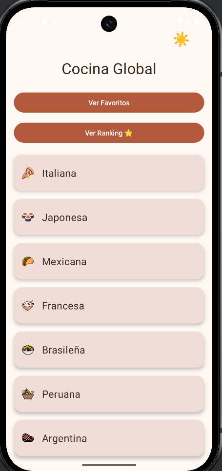
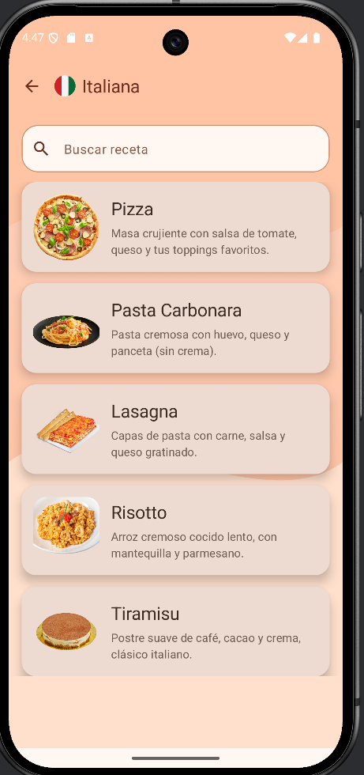
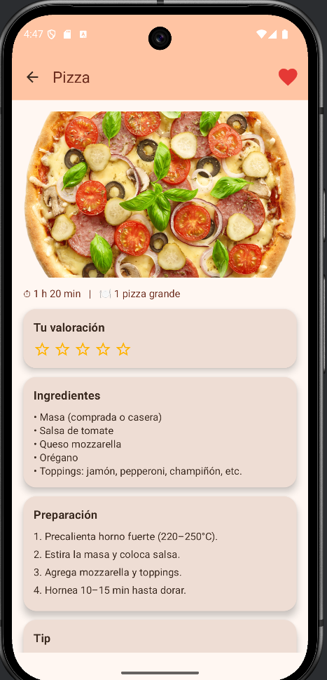
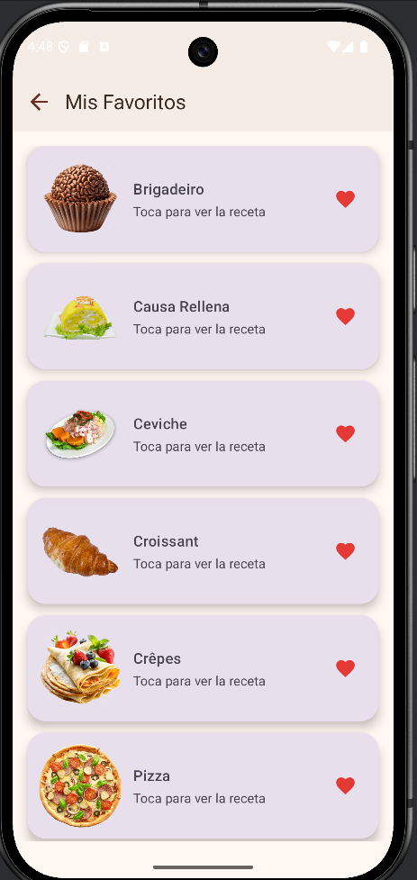
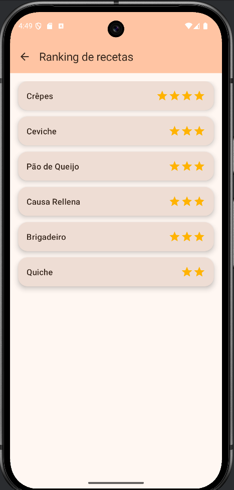

# 🍲 Cocina Global

Aplicación Android desarrollada en Kotlin que permite explorar recetas de distintas culturas, visualizar detalles completos, guardar favoritas y calificarlas mediante un sistema de ranking.

---

## 📱 Características principales

- 🌍 Exploración de recetas por categoría (Italiana, Japonesa, Mexicana, etc.)
- 🔍 Búsqueda de recetas
- 📋 Listado dinámico de recetas
- 📖 Vista detallada de cada receta
- 🥘 Ingredientes y pasos de preparación
- ⏱️ Tiempo estimado de cocción
- ⭐ Sistema de valoración con estrellas
- ❤️ Gestión de recetas favoritas
- 🏆 Ranking de recetas según valoración
- 🎨 Interfaz moderna con Jetpack Compose

---

## 🖼️ Pantallas de la aplicación

### 🏠 Pantalla principal
Permite navegar entre categorías y acceder a favoritos y ranking.

---

### 📋 Listado de recetas
Muestra recetas según la categoría seleccionada con opción de búsqueda.

---

### 📖 Detalle de receta
Incluye imagen, ingredientes, preparación, tiempo y valoración.

---

### ❤️ Favoritos
Permite guardar y acceder rápidamente a recetas seleccionadas por el usuario.

---

### 🏆 Ranking
Muestra las recetas mejor valoradas por los usuarios.

---

## 🛠️ Tecnologías utilizadas

- Kotlin
- Android Studio
- Jetpack Compose
- Material Design 3

---

## 🚀 Funcionalidades destacadas

- Navegación entre múltiples pantallas
- Gestión de estado en la UI
- Interfaz intuitiva y moderna
- Arquitectura modular

---

## 📌 Autor

Carlos Miguel Abanto Cabanillas  
Ingeniería Informática | Android Developer
